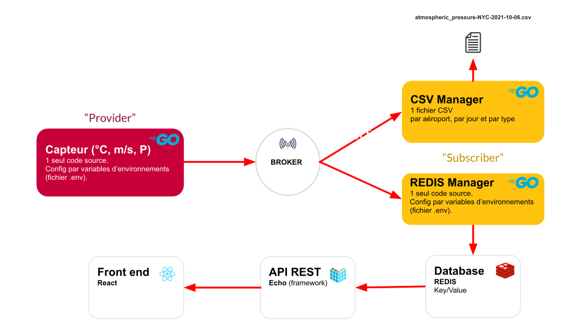

# Météo des aéroports

A Go project to save data from multiple weather sensors using a MQTT broker into a Redis database accessible by an Echo Rest API. 
 
## Using the app

To build all files in bin/ :

```bash
make build
```

To build and launch the api framework :

```bash
make http
```

To build and launch both subscribers (to fulfill redis database and csv file) :

```bash
make sub
```

To build and launch a probe measurement :

```bash
make probe
```

To launch the database :

1. Firstly, launch the server to allow database requests and centralize the several communication modes :

```bash
redis-server
```

2. Secondly, launch the redis client to interact with the redis database

```bash
redis-cli
```

## Skills acquired

Thanks to this project we have been able to increase our skills on the following technologies :

- DataBase REDIS
- Protocole with MQTT Brokker
- Langage GO
- Inteface Paho GO

## Architecture

### Components

The following components are communicating with MQTT and HTTP

- Broker MQTT : Moquitto
- Database NoSQL Key-Value : REDIS

<p></p>

The react client application is available to the following page : [aeroport_sim](https://github.com/Naedri/aeroport_sim)
